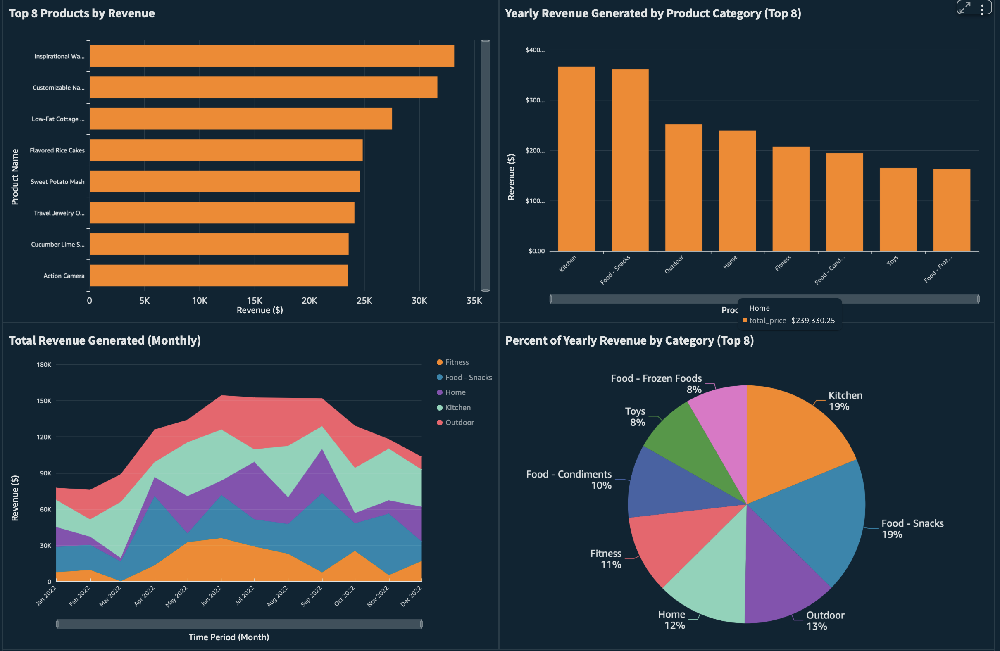

# AWS Sales Data Analytics Project

This project demonstrates a **serverless data analytics pipeline** using AWS to process and visualize sales data. This is sample data from Mockaroo, so the insights and data are not the focus. The focus is the AWS architecture!

## **Architecture**

**AWS Services Used:**

- **Amazon S3** – stores raw and processed data  
- **AWS Glue** – crawls data and builds a catalog  
- **Amazon Athena** – runs SQL queries on S3 data  
- **Amazon QuickSight** – creates interactive dashboards  
- **AWS CloudFormation** – automates resource creation

---

## **Project Overview**

The goal of this project is to provide actionable business insights from sales data using AWS analytics services.

### **Key Metrics Visualized:**

- **Total Revenue by Product Category**  
- **Monthly Revenue Trends**  
- **Top Customers by Spending**  
- **Customer Spending by Category**

---

## **Deployment Steps**

### **1️⃣ Deploy Infrastructure**

Launch the CloudFormation stack using:

This creates:

- S3 buckets  
- Glue database & crawler  
- IAM roles  

---

### **2️⃣ Run Data Analysis in Athena**

Use the SQL scripts in:

Queries include:

- Table creation  
- Revenue calculations  
- Customer insights  

---

### **3️⃣ Build Dashboard in QuickSight**

Create visuals using the Athena queries. Example visuals include:

- Bar charts  
- Line/area charts  
- Pie charts  
- Customer segmentation analysis

---

## **Business Insights**

Some of the findings include:

- The top product categories were Kitchen and Food - Snacks, each contributing 19% of total revenue, respectively.
- June 2022 showed the highest revenue for the year, followed by November 2022
- The top 5 customers account for YY% of total sales

---

## **Skills Demonstrated**

- Cloud Data Engineering  
- Serverless Analytics Architecture  
- AWS Glue & Athena  
- Data Visualization with QuickSight  
- Infrastructure as Code (IaC) with CloudFormation

---

## **Author**

[Nick Lewis]  
[https://www.linkedin.com/in/nick-lewis-pmp-062844176/]  

